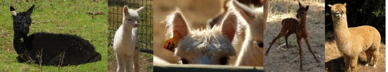

<h1>Evergreen Terrace Farms Home Page</h1>

Nestled in the Willamette Valley, Oregon's wine country, Evergreen
Terrace Farms is just fifteen miles west of Salem, Oregon, and only five
miles from Western Oregon University.

At Evergreen Terrace Farms, we breed Huycaya alpacas for colored,
ribbon-winning fleeces. We offer breeding and non-breeding (fiber) alpaca
stock in a spectrum of colors, as well as stud services from our
color-producing alpaca studs.

Please come and visit us! <a href="contact">Directions and contact
information</a> are available via the links to the right. 

 
